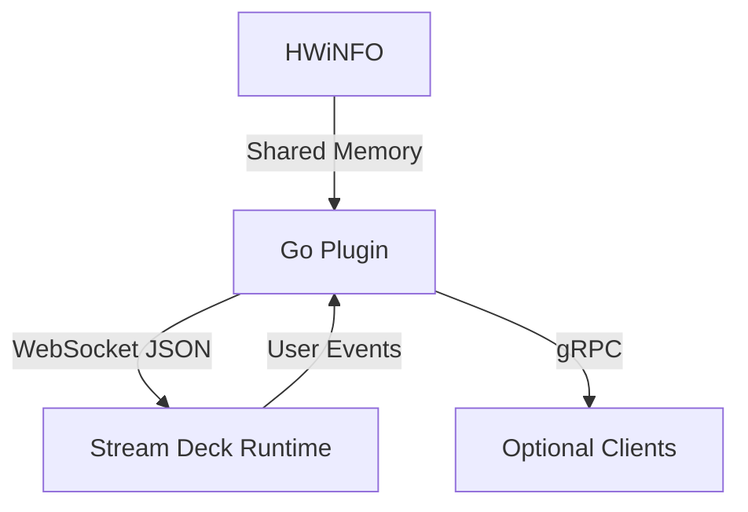
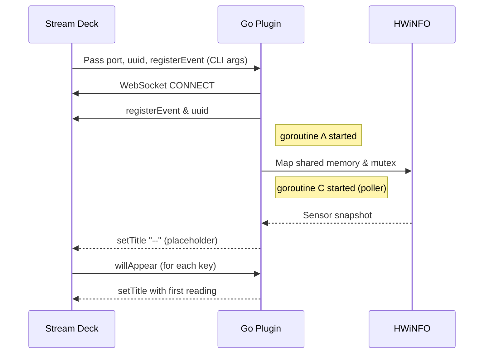

# Architecture Overview
## Table of Contents
- [High-Level Diagram](#high-level-diagram)
- [Components](#components)
  - [Go Plugin Binary](#go-plugin-binary-cmdhwinfo_streamdeck_plugin)
  - [HWiNFO Subsystem](#hwinfo-subsystem-internalhwinfo)
  - [StreamDeck SDK Layer](#streamdeck-sdk-layer-pkgstreamdeck)
  - [Application Layer](#application-layer-internalapphwinfostreamdeckplugin)
  - [Property Inspector Front-End](#property-inspector-front-end-sdplugin)
  - [gRPC Service](#grpc-service-pkgservice)
- [Deployment Topology](#deployment-topology)
- [Data Flow](#data-flow)
- [Error & Shutdown Considerations](#error--shutdown-considerations-planned)

_Comprehensive system snapshot—fill out each section as implementation evolves._

## High-Level Diagram



## Components

1. **Go Plugin Binary** (`cmd/hwinfo_streamdeck_plugin`)
   - Connects to Stream Deck WebSocket API.
   - Reads HWiNFO shared memory every second.
   - Applies custom formatting (boolean, thousands separator, dynamic units).
   - Renders text with configurable stroke effects.
2. **HWiNFO Subsystem** (`internal/hwinfo/*`)
   - CGo bindings to shared memory + helper structs.
   - Enhanced degree symbol handling with UTF-8/ISO8859-1 support.
3. **StreamDeck SDK Layer** (`pkg/streamdeck/*`)
   - Thin wrapper around Elgato messages.
   - Modern SDK v6.4+ compatibility.
4. **Application Layer** (`internal/app/hwinfostreamdeckplugin/*`)
   - Manages actions, settings, and tile updates.
   - Implements custom formatting extensions.
   - Handles stroke configuration and rendering.
5. **Front-End Property Inspector** (`com.exension.hwinfo.sdPlugin`)
   - HTML/CSS/JS for per-tile configuration.
   - Stroke colour and size controls.
   - Real-time preview of formatting options.
6. **gRPC Plugin Service** (`pkg/service/*`) *(optional)*
   - Exposes sensor data to other processes.

## Deployment Topology

| Process | Runs On | Notes |
| --- | --- | --- |
| Stream Deck | User desktop | WebSocket broker for plugins |
| Go Plugin | Same desktop | Single executable, launched by Stream Deck |
| HWiNFO | Same desktop | Provides sensor data via shared memory |

## Data Flow

1. Go plugin starts; opens WebSocket connection provided by Stream Deck.
2. Every second, plugin reads shared memory, maps sensors → readings.
3. Plugin updates each subscribed Stream Deck context with latest values.
4. User interaction (press) triggers action-specific behavior.
5. Optional: External client connects via gRPC to pull sensor snapshots.

## Threading & Concurrency Model

The plugin follows a **fan-in / fan-out** pattern:

```text
                    ┌──────────────────┐
                    │   OS Thread      │ (main)
                    └────────┬─────────┘
                             │ dial Stream Deck WS
                             ▼
                    ┌──────────────────┐
                    │  WS Rx Loop      │ goroutine A
                    └────────┬─────────┘
                             │ deserialize events
                             ▼
                    ┌──────────────────┐
                    │  Event Bus (chan)│ ← buffered channel (size 64)
                    └────────┬─────────┘
          ┌──────────────────┴───────────────────┐
          ▼                                      ▼
┌──────────────────┐                     ┌──────────────────┐
│ Action Manager   │ goroutine B         │  Sensor Poller   │ goroutine C
└──────────────────┘                     └──────────────────┘
          │ update tiles                         │ copies shared-mem each sec
          ▼                                      ▼
  `pkg/streamdeck`                 `internal/hwinfo` parsing
```

*Only three long-lived goroutines are used:* one for WebSocket receive, one for action-timer updates, and one for sensor polling. Outbound WebSocket writes are protected by a `sync.Mutex` to keep frames atomic.

## Startup Sequence



## Shutdown Sequence

1. Stream Deck sends the `pluginWillExit` event **or** OS signals the process.
2. Plugin cancels a root `context.Context`, notifying goroutines.
3. WebSocket connection closed gracefully (`close 1000`).
4. Shared-memory view unmapped; mutex released.
5. Goroutines join via `sync.WaitGroup`; process exits `0`.

## Error & Shutdown Considerations

| Area | Possible Failure | Mitigation |
| --- | --- | --- |
| WebSocket | Network glitch / SD restart | Auto-reconnect with back-off (≤3 retries, then give up & show alert) |
| Shared Memory | Signature becomes `DEAD` | Tile titles switch to `--` and red border; poller keeps trying every second |
| Mutex | Left locked after crash | On startup the plugin waits up to 5 s for mutex, then logs error and continues read-only |
| JSON Encoding | Oversized payload (>8 KB) | Payload truncated server-side; WARNING log emitted |
| Panic | Unexpected bug | `main()` wraps `defer recover()`; dumps stack to log file and attempts graceful shutdown |

If unrecoverable, the plugin emits a `showAlert` on affected keys before exit so the user can react.

---

*Document complete — update when architectural decisions change.*
